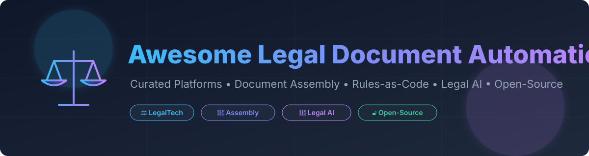
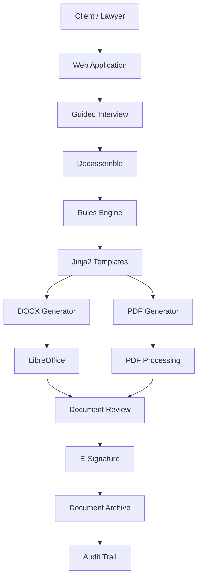

# Awesome-Legal-Document-Automation



# ⚖️ Top Legal Document Automation


<p align="center">
  <a href="https://github.com/ishandutta2007/Awesome-Awesome-Awesome"></a>
  <a href="https://discord.gg/jc4xtF58Ve"></a>
  <a href="https://github.com/ishandutta2007/Awesome-Legal-Document-Automation/stargazers"></a>
  <a href="https://github.com/ishandutta2007/Awesome-Legal-Document-Automation/network/members"></a>
  <a href="https://github.com/ishandutta2007/Awesome-Legal-Document-Automation/blob/main/LICENSE"></a>
  <a href="https://github.com/ishandutta2007"></a>
</p>

> A curated list of **legal document automation platforms, document assembly systems, no-code legal workflow tools, rules-as-code platforms and open-source software** for automating the creation of contracts, legal forms, pleadings, applications and other legal documents.


Legal document automation transforms structured information, questionnaires, business rules and templates into customized legal documents.


Typical workflows include:


* Legal intake

* Guided interviews

* Document assembly

* Contract generation

* Legal forms

* Conditional clauses

* Template management

* Rules-based drafting

* PDF generation

* DOCX generation

* E-signatures

* Client portals

* Legal workflows

* AI-assisted drafting

* Rules-as-code

* Document review

* Document lifecycle management


The commercial ecosystem includes platforms such as **Gavel, ClauseBase, Documate, Woodpecker, Legito, HotDocs, Afterpattern, BRYTER, Checkbox and Avvoka**.


This repository primarily emphasizes **open-source and self-hostable alternatives**, while keeping commercial SaaS platforms separate.


> **Important:** open-source document automation software can reproduce much of the *software layer* of commercial legal-document platforms, but it does not automatically provide legal expertise, jurisdiction-specific validation, professional responsibility, regulatory compliance or legal advice.


---


## 📑 Table of Contents


* [☁️ SaaS/Hosted Platforms](#️-saashosted-platforms)

* [🌍 Open-Source](#-open-source)

* [📄 Open-Source Document Assembly](#-open-source-document-assembly)

* [🧑‍⚖️ Open-Source Legal Interview Platforms](#️-open-source-legal-interview-platforms)

* [🧩 Open-Source Template Engines](#-open-source-template-engines)

* [📜 Open-Source Rules-as-Code](#-open-source-rules-as-code)

* [⚖️ Open-Source Legal Knowledge & Contract Automation](#️-open-source-legal-knowledge--contract-automation)

* [📝 Open-Source DOCX Automation](#-open-source-docx-automation)

* [📑 Open-Source PDF Automation](#-open-source-pdf-automation)

* [✍️ Open-Source E-Signature Infrastructure](#️-open-source-e-signature-infrastructure)

* [🤖 Open-Source AI Legal Document Automation](#-open-source-ai-legal-document-automation)

* [🔄 Open-Source Document Lifecycle Management](#-open-source-document-lifecycle-management)

* [🏗️ Legal Document Automation Architecture](#️-legal-document-automation-architecture)

* [🔄 Open-Source Legal Document Automation Architecture](#-open-source-legal-document-automation-architecture)

* [🧠 Rules-as-Code Architecture](#-rules-as-code-architecture)

* [🧩 Commercial Platform → Open-Source Equivalent](#-commercial-platform--open-source-equivalent)

* [⚖️ Commercial vs Open-Source](#️-commercial-vs-open-source)

* [🚀 Recommended Open-Source Stacks](#-recommended-open-source-stacks)

* [📊 Legal Document Automation Comparison](#-legal-document-automation-comparison)

* [🎯 Recommended Projects by Use Case](#-recommended-projects-by-use-case)

* [🏢 Building a Gavel Alternative](#-building-a-gavel-alternative)

* [🏭 Building a HotDocs Alternative](#-building-a-hotdocs-alternative)

* [🌐 Open-Source Legal Automation Landscape](#-open-source-legal-automation-landscape)

* [🧠 Why Open-Source Legal Automation Matters](#-why-open-source-legal-automation-matters)

* [🤝 Contributing](#-contributing)

* [⚠️ Disclaimer](#️-disclaimer)


---


# ☁️ SaaS/Hosted Platforms

Commercial platforms provide managed authoring environments, document templates, interviews, workflows, integrations and document generation without requiring users to build the underlying infrastructure.

> **Market Size & Overview:** The Legal Document Automation & Contract Lifecycle Management (CLM) market size is estimated at **$3.2 Billion in 2026** and is projected to reach **$7.8 Billion by 2032**, growing at a CAGR of ~15.8%. The sector is currently **highly fragmented**, split between high-growth AI-native CLMs (Ironclad, SpotDraft), established enterprise legal suites (Thomson Reuters, Litera), and dedicated no-code interview/assembly platforms (Gavel, Legito).

| Platform | Company | Revenue / Valuation (Est.) | Starting Price | Free Tier / Trial Limits | Primary Focus | Key Capabilities |
| :--- | :--- | :--- | :--- | :--- | :--- | :--- |
| [Ironclad](https://ironcladapp.com/) | Ironclad | **$3.2B** (Valuation) | $500/mo (Billed annually) | 14-day free trial on request | Contract lifecycle | Contract creation, workflows and lifecycle management |
| [SpotDraft](https://www.spotdraft.com/) | SpotDraft | **$300M** (Valuation) | $350/mo (Starter tier) | 14-day free demo / sandbox trial | Contract lifecycle | Contract creation, workflows and management |
| [Litera Create](https://www.litera.com/) | Litera | **$300M+** (Annual Revenue) | $250/user/yr (Enterprise tier) | No free tier; demo upon request | Document drafting | Legal document creation and Microsoft Word integration |
| [Contract Express](https://legal.thomsonreuters.com/) | Thomson Reuters | **$250M+** (Legal Division Rev) | $150/user/mo (Enterprise) | 30-day enterprise trial for legal teams | Enterprise document automation | Legal templates, interviews and document assembly |
| [BRYTER](https://bryter.com/) | BRYTER | **$210M** (Valuation) | $400/mo (Business tier) | 14-day trial for enterprise users | No-code legal automation | Decision trees, legal workflows, client applications |
| [Gavel](https://www.gavel.io/) | Gavel | **$50M** (Valuation) | $99/mo (Standard plan) | 14-day free trial (no credit card required) | No-code legal automation | Document automation, intake, workflows, PDF/DOCX automation |
| [Juro](https://juro.com/) | Juro | **$50M** (Valuation) | $59/user/mo (Essential plan) | Free plan (Up to 50 active contracts/yr) | Contract automation | Collaborative contract creation and workflow |
| [ClauseBase](https://www.clausebase.com/) | ClauseBase | **$20M** (Valuation) | €149/mo (Drafting plan) | 14-day full feature free trial | Contract automation | Clause libraries, document automation, conditional logic |
| [Contractbook](https://contractbook.com/) | Contractbook | **$20M** (Valuation) | $199/mo (Core plan) | 14-day free trial | Contract management | Contract creation, collaboration and signing |
| [Legito](https://www.legito.com/) | Legito | **$15M** (Valuation) | $120/user/mo (Small Business) | 14-day free trial | Document automation | No-code templates, document assembly and workflows |
| [Documate](https://www.documate.org/) | Documate / Gavel | **$15M** (Valuation) | $99/mo (Merged with Gavel) | 14-day free trial | Legal document automation | Document assembly and guided interviews |
| [Checkbox](https://www.checkbox.ai/) | Checkbox | **$15M** (Valuation) | $250/mo (Starter team tier) | 14-day trial upon approval | Legal workflow automation | No-code legal apps, intake and document automation |
| [Avvoka](https://www.avvoka.com/) | Avvoka | **$12M** (Valuation) | £99/user/mo (Starter plan) | 14-day trial for qualified teams | Contract automation | Contract drafting, automation, collaboration and workflows |
| [Clio Draft](https://www.clio.com/) | Clio | **$10M+** (Draft Division Rev) | $49/user/mo (Add-on to Clio) | 7-day free trial | Legal document automation | Document automation integrated with legal practice management |
| [Woodpecker](https://www.woodpeckerweb.com/) | Woodpecker | **$10M** (Valuation) | $39/user/mo (Pro plan) | 14-day free trial (Up to 5 document fills) | Legal document automation | Interviews, document assembly and workflow automation |
| [Neota Logic](https://www.neotalogic.com/) | Neota Logic | **$10M** (Valuation) | $300/mo (Creator tier) | 14-day demo environment trial | Legal automation | Expert systems, decision trees and legal workflows |
| [DocJuris](https://www.docjuris.com/) | DocJuris | **$8M** (Valuation) | $150/user/mo (Editor plan) | 14-day free trial | Contract automation | Contract workflows and review |
| [HotDocs](https://www.hotdocs.com/) | Caret Legal | **$8M** (Valuation) | $80/user/mo (Standard plan) | 30-day developer evaluation trial | Document automation | Template-based document assembly and interviews |
| [Malbek](https://www.malbek.io/) | Malbek | **$8M** (Valuation) | $200/mo (Growth tier) | 14-day free demo trial | CLM | Contract lifecycle and automation |
| [Afterpattern](https://afterpattern.com/) | Afterpattern | **$5M** (Valuation) | $79/mo (Pro plan) | 14-day free trial | Legal automation | Visual document automation and workflows |

> **Historical note:** Documate has been incorporated into the Gavel product family; Gavel's own documentation describes Documate as having become Gavel.

----------------------------------------------------- | ---------------- | ------------------------------ | ------------------------------------------------------------- |

| [Gavel](https://www.gavel.io/)                        | Gavel            | No-code legal automation       | Document automation, intake, workflows, PDF/DOCX automation   |

| [ClauseBase](https://www.clausebase.com/)             | ClauseBase       | Contract automation            | Clause libraries, document automation, conditional logic      |

| [Documate](https://www.documate.org/)                 | Documate / Gavel | Legal document automation      | Document assembly and guided interviews                       |

| [Woodpecker](https://www.woodpeckerweb.com/)          | Woodpecker       | Legal document automation      | Interviews, document assembly and workflow automation         |

| [Legito](https://www.legito.com/)                     | Legito           | Document automation            | No-code templates, document assembly and workflows            |

| [HotDocs](https://www.hotdocs.com/)                   | Caret Legal      | Document automation            | Template-based document assembly and interviews               |

| [Afterpattern](https://afterpattern.com/)             | Afterpattern     | Legal automation               | Visual document automation and workflows                      |

| [BRYTER](https://bryter.com/)                         | BRYTER           | No-code legal automation       | Decision trees, legal workflows, client applications          |

| [Checkbox](https://www.checkbox.ai/)                  | Checkbox         | Legal workflow automation      | No-code legal apps, intake and document automation            |

| [Avvoka](https://www.avvoka.com/)                     | Avvoka           | Contract automation            | Contract drafting, automation, collaboration and workflows    |

| [Clio Draft](https://www.clio.com/)                   | Clio             | Legal document automation      | Document automation integrated with legal practice management |

| [Litera Create](https://www.litera.com/)              | Litera           | Document drafting              | Legal document creation and Microsoft Word integration        |

| [Contract Express](https://legal.thomsonreuters.com/) | Thomson Reuters  | Enterprise document automation | Legal templates, interviews and document assembly             |

| [Neota Logic](https://www.neotalogic.com/)            | Neota Logic      | Legal automation               | Expert systems, decision trees and legal workflows            |

| [DocJuris](https://www.docjuris.com/)                 | DocJuris         | Contract automation            | Contract workflows and review                                 |

| [SpotDraft](https://www.spotdraft.com/)               | SpotDraft        | Contract lifecycle             | Contract creation, workflows and management                   |

| [Ironclad](https://ironcladapp.com/)                  | Ironclad         | Contract lifecycle             | Contract creation, workflows and lifecycle management         |

| [Juro](https://juro.com/)                             | Juro             | Contract automation            | Collaborative contract creation and workflow                  |

| [Contractbook](https://contractbook.com/)             | Contractbook     | Contract management            | Contract creation, collaboration and signing                  |

| [Malbek](https://www.malbek.io/)                      | Malbek           | CLM                            | Contract lifecycle and automation                             |


> **Historical note:** Documate has been incorporated into the Gavel product family; Gavel's own documentation describes Documate as having become Gavel.


---


# 🌍 Open-Source


The open-source legal document automation ecosystem is more fragmented than the commercial ecosystem.


Rather than one project reproducing every feature of Gavel or HotDocs, an open-source stack typically combines:


```text

                 LEGAL DOCUMENT AUTOMATION

                            │

        ┌───────────────────┼───────────────────┐

        │                   │                   │

        ▼                   ▼                   ▼

   Interviews          Templates           Legal Rules

        │                   │                   │

        ▼                   ▼                   ▼

   Docassemble       Jinja2 / DOCX       Blawx / Catala

        │                   │                   │

        └───────────────────┼───────────────────┘

                            ▼

                    Document Generation

                            │

                ┌───────────┴───────────┐

                ▼                       ▼

              DOCX                     PDF

                │                       │

                └───────────┬───────────┘

                            ▼

                       E-Signature

```


The most important open-source project in this space is **Docassemble**, an MIT-licensed expert-system platform for guided interviews and document assembly built around Python, YAML and Markdown.


---


# 📄 Open-Source Document Assembly


| Project                                                                               | Description                                                | License             |

| ------------------------------------------------------------------------------------- | ---------------------------------------------------------- | ------------------- |

| [Docassemble](https://github.com/jhpyle/docassemble)                                  | Full-stack guided interviews and legal document assembly   | MIT                 |

| [docassemble-AssemblyLine](https://github.com/SuffolkLITLab/docassemble-AssemblyLine) | Framework for rapidly building legal form interviews       | MIT                 |

| [docassemble-ALWeaver](https://github.com/SuffolkLITLab/docassemble-ALWeaver)         | Generates Docassemble interview scaffolding from documents | Open Source         |

| [open-agreements](https://github.com/CommonAccord/open-agreements)                    | Structured legal agreement templates                       | Apache-2.0          |

| [CommonAccord](https://github.com/CommonAccord)                                       | Structured and composable legal agreements                 | MIT / OSS ecosystem |

| [Accord Project](https://github.com/accordproject)                                    | Smart legal contracts and templating                       | Apache-2.0          |

| [Cicero](https://github.com/accordproject/cicero)                                     | Template language and engine for legal agreements          | Apache-2.0          |

| [Wraft](https://github.com/wraft/wraft)                                               | Document lifecycle and generation platform                 | AGPL-3.0            |


Docassemble supports several document-generation approaches, including Markdown-generated documents, DOCX templates using Jinja2 and fillable PDF templates.


---


# 🧑‍⚖️ Open-Source Legal Interview Platforms


Guided interviews are the core mechanism behind many legal-document automation systems.


```text

Question

   │

   ▼

Answer

   │

   ▼

Conditional Logic

   │

   ├──► More Questions

   │

   ├──► Optional Clause

   │

   └──► Different Template

   │

   ▼

Generated Legal Document

```


| Project                                                                               | Description                                         |

| ------------------------------------------------------------------------------------- | --------------------------------------------------- |

| [Docassemble](https://github.com/jhpyle/docassemble)                                  | Full legal interview and document assembly platform |

| [docassemble-AssemblyLine](https://github.com/SuffolkLITLab/docassemble-AssemblyLine) | Reusable interview-building framework               |

| [A2J Author](https://www.a2jauthor.org/)                                              | Guided legal interviews and form completion         |

| [Blawx](https://github.com/Lexpedite/blawx)                                           | Visual rules-as-code environment                    |

| [OpenLaw](https://github.com/openlawteam/openlaw)                                     | Structured agreement automation                     |

| [CommonAccord](https://github.com/CommonAccord)                                       | Structured legal transactions                       |


Docassemble interviews can run as web applications and can contain complex branching logic and customized workflows.


---


# 🧩 Open-Source Template Engines


Document automation does not always require a complete legal platform.


A developer can combine a template engine with a document-generation library.


| Project                                                                  | Technology         | Typical Use                |

| ------------------------------------------------------------------------ | ------------------ | -------------------------- |

| [Jinja2](https://github.com/pallets/jinja)                               | Python             | Template logic             |

| [python-docx-template](https://github.com/elapouya/python-docx-template) | Python / Jinja2    | DOCX generation            |

| [docxtpl](https://github.com/elapouya/python-docx-template)              | Python             | Word templates             |

| [Mako](https://github.com/makotemplates/mako)                            | Python             | Dynamic document templates |

| [Handlebars](https://github.com/handlebars-lang/handlebars.js)           | JavaScript         | Template generation        |

| [Liquid](https://github.com/Shopify/liquid)                              | Ruby               | Safe template rendering    |

| [Nunjucks](https://github.com/mozilla/nunjucks)                          | JavaScript         | Jinja-like templates       |

| [Mustache](https://github.com/mustache)                                  | Multiple languages | Logic-light templates      |


A simple legal-document generation system can therefore be implemented as:


```text

Structured Data

      │

      ▼

Jinja2

      │

      ▼

DOCX Template

      │

      ▼

Generated Contract

```


---


# 📜 Open-Source Rules-as-Code


Rules-as-code allows legal or regulatory logic to be represented as executable rules.


```text

                     Legal Rule

                         │

                         ▼

                  Machine-readable

                       Logic

                         │

              ┌──────────┼──────────┐

              ▼          ▼          ▼

           Eligible   Ineligible   Review

              │          │          │

              └──────────┼──────────┘

                         ▼

                   Legal Workflow

```


| Project                                                           | Description                                      |

| ----------------------------------------------------------------- | ------------------------------------------------ |

| [Blawx](https://github.com/Lexpedite/blawx)                       | Visual rules-as-code environment                 |

| [Catala](https://github.com/CatalaLang/catala)                    | Programming language for formalizing legislation |

| [OpenFisca](https://github.com/openfisca/openfisca-core)          | Open-source policy and legislation simulation    |

| [Accord Project](https://github.com/accordproject)                | Smart legal contracts                            |

| [Cicero](https://github.com/accordproject/cicero)                 | Legal contract template language                 |

| [LegalRuleML](https://www.oasis-open.org/committees/legalruleml/) | Standardization of legal rules                   |

| [Akoma Ntoso](https://github.com/akomantoso)                      | Structured legal-document markup ecosystem       |

| [LEOS](https://github.com/Metanorma/authoring)                    | Legislative drafting ecosystem                   |


These projects are not all direct document-automation replacements; they are important **building blocks for encoding legal logic and structured legal content**.


---


# ⚖️ Open-Source Legal Knowledge & Contract Automation


## Accord Project


[Accord Project](https://github.com/accordproject) is an open-source ecosystem for programmable legal agreements.


Its ecosystem includes:


* Cicero templates

* Legal markup

* Contract modeling

* Clause logic

* Smart legal contracts

* Structured contract data


```text

Legal Agreement

      │

      ▼

Cicero Template

      │

      ▼

Contract Data

      │

      ▼

Rules / Logic

      │

      ▼

Executable Agreement

```


---


## CommonAccord


[CommonAccord](https://github.com/CommonAccord) focuses on representing legal agreements as structured, composable and interoperable components.


This makes it conceptually relevant to:


* Clause libraries

* Modular contracts

* Reusable legal language

* Structured legal transactions

* Machine-readable agreements


---


# 📝 Open-Source DOCX Automation


Microsoft Word remains central to legal workflows.


Useful open-source projects include:


| Project                                                                  | Description                    |

| ------------------------------------------------------------------------ | ------------------------------ |

| [python-docx](https://github.com/python-openxml/python-docx)             | Read/write DOCX files          |

| [python-docx-template](https://github.com/elapouya/python-docx-template) | Jinja2-based DOCX templating   |

| [SuperDoc](https://github.com/superdoc-dev/superdoc)                     | Web-based DOCX editor          |

| [Mammoth](https://github.com/mwilliamson/mammoth.js)                     | DOCX → HTML conversion         |

| [LibreOffice](https://github.com/LibreOffice/core)                       | Headless document conversion   |

| [docx4j](https://github.com/plutext/docx4j)                              | Java DOCX manipulation         |

| [Open XML SDK](https://github.com/dotnet/Open-XML-SDK)                   | Open XML document manipulation |


A production automation pipeline can therefore be:


```text

Interview

   │

   ▼

Structured Answers

   │

   ▼

Jinja2

   │

   ▼

python-docx-template

   │

   ▼

DOCX

   │

   ▼

LibreOffice

   │

   ▼

PDF

```


---


# 📑 Open-Source PDF Automation


| Project                                                   | Description                 |

| --------------------------------------------------------- | --------------------------- |

| [WeasyPrint](https://github.com/Kozea/WeasyPrint)         | HTML/CSS → PDF              |

| [ReportLab](https://github.com/Distrotech/reportlab)      | Programmatic PDF generation |

| [PyMuPDF](https://github.com/pymupdf/PyMuPDF)             | PDF processing              |

| [pypdf](https://github.com/py-pdf/pypdf)                  | PDF manipulation            |

| [PDF.js](https://github.com/mozilla/pdf.js)               | PDF rendering               |

| [LibreOffice](https://github.com/LibreOffice/core)        | Office → PDF conversion     |

| [wkhtmltopdf](https://github.com/wkhtmltopdf/wkhtmltopdf) | HTML → PDF                  |

| [Apache PDFBox](https://github.com/apache/pdfbox)         | Java PDF processing         |


---


# ✍️ Open-Source E-Signature Infrastructure


Document automation frequently ends with signature collection.


| Project                                                  | Description                       |

| -------------------------------------------------------- | --------------------------------- |

| [DocuSeal](https://github.com/docusealco/docuseal)       | Self-hosted document signing      |

| [OpenSign](https://github.com/opensignlabs/opensign)     | Open-source e-signature platform  |

| [LibreSign](https://github.com/LibreSign/libresign)      | Open-source signing for Nextcloud |

| [Documenso](https://github.com/documenso/documenso)      | Open-source document signing      |

| [SignServer](https://github.com/Keyfactor/signserver-ce) | Digital-signature infrastructure  |

| [OpenXPKI](https://github.com/openxpki/openxpki)         | PKI infrastructure                |


A complete legal automation workflow can therefore become:


```text

Intake

  ↓

Interview

  ↓

Document Assembly

  ↓

Review

  ↓

Approval

  ↓

E-Signature

  ↓

Archive

```


---


# 🤖 Open-Source AI Legal Document Automation


AI can be added on top of traditional deterministic document automation.


```text

                     User

                      │

                      ▼

                AI Assistant

                      │

          ┌───────────┼───────────┐

          ▼           ▼           ▼

       Intake      Drafting    Analysis

          │           │           │

          └───────────┼───────────┘

                      ▼

                Rules Engine

                      │

                      ▼

                Template Engine

                      │

                      ▼

                 DOCX / PDF

```


Useful open-source building blocks:


| Project                                                         | Role                             |

| --------------------------------------------------------------- | -------------------------------- |

| [Docassemble](https://github.com/jhpyle/docassemble)            | Deterministic legal interviews   |

| [LangChain](https://github.com/langchain-ai/langchain)          | LLM application framework        |

| [LlamaIndex](https://github.com/run-llama/llama_index)          | Retrieval and document workflows |

| [Haystack](https://github.com/deepset-ai/haystack)              | RAG / document pipelines         |

| [vLLM](https://github.com/vllm-project/vllm)                    | LLM inference                    |

| [Ollama](https://github.com/ollama/ollama)                      | Local model serving              |

| [Qdrant](https://github.com/qdrant/qdrant)                      | Vector database                  |

| [Milvus](https://github.com/milvus-io/milvus)                   | Vector database                  |

| [Weaviate](https://github.com/weaviate/weaviate)                | Vector search                    |

| [Unstructured](https://github.com/Unstructured-IO/unstructured) | Document parsing                 |

| [Docling](https://github.com/docling-project/docling)           | Document understanding           |

| [GROBID](https://github.com/kermitt2/grobid)                    | Structured document extraction   |


A useful principle is:


> **Use AI for assistance and discovery, but keep legally consequential document logic deterministic wherever possible.**


---


# 🔄 Open-Source Document Lifecycle Management


Document automation increasingly overlaps with document lifecycle management.


| Project                                                         | Primary Focus                 |

| --------------------------------------------------------------- | ----------------------------- |

| [Wraft](https://github.com/wraft/wraft)                         | Document lifecycle management |

| [Docassemble](https://github.com/jhpyle/docassemble)            | Legal document generation     |

| [DocuSeal](https://github.com/docusealco/docuseal)              | Signing                       |

| [OpenSign](https://github.com/opensignlabs/opensign)            | Signing                       |

| [Documenso](https://github.com/documenso/documenso)             | Signing                       |

| [SuperDoc](https://github.com/superdoc-dev/superdoc)            | Document editing              |

| [Nextcloud](https://github.com/nextcloud/server)                | Document collaboration        |

| [Paperless-ngx](https://github.com/paperless-ngx/paperless-ngx) | Document management           |

| [Mayan EDMS](https://github.com/mayan-edms/Mayan-EDMS)          | Document management           |


---


# 🏗️ Legal Document Automation Architecture


The basic architecture of a commercial document automation platform is:


```text

                         CLIENT

                           │

                           ▼

                    Intake / Portal

                           │

                           ▼

                    Guided Interview

                           │

                           ▼

                     Rules Engine

                           │

              ┌────────────┼────────────┐

              ▼            ▼            ▼

           Clause A     Clause B     Clause C

              │            │            │

              └────────────┼────────────┘

                           ▼

                    Template Engine

                           │

                    ┌──────┴──────┐

                    ▼             ▼

                  DOCX           PDF

                    │             │

                    └──────┬──────┘

                           ▼

                        Review

                           │

                           ▼

                       E-Sign

                           │

                           ▼

                        Archive

```


---


# 🔄 Open-Source Legal Document Automation Architecture





---


# 🧠 Rules-as-Code Architecture


For complex legal workflows, deterministic rules should remain separate from language generation.


```text

                       Legal Knowledge

                             │

                             ▼

                     Rules-as-Code

                             │

             ┌───────────────┼───────────────┐

             ▼               ▼               ▼

          Eligibility     Jurisdiction     Clauses

             │               │               │

             └───────────────┼───────────────┘

                             ▼

                      Document Model

                             │

                             ▼

                       Template Engine

                             │

                             ▼

                       Final Document

```


This allows the AI layer to assist with drafting without making the entire document-generation process dependent on probabilistic output.


---


# 🧩 Commercial Platform → Open-Source Equivalent


| Commercial Platform              | Open-Source Equivalent / Building Blocks                     |

| -------------------------------- | ------------------------------------------------------------ |

| **Gavel**                        | Docassemble + AssemblyLine + Jinja2 + python-docx-template   |

| **Documate**                     | Docassemble + AssemblyLine + Jinja2                          |

| **ClauseBase**                   | Docassemble + Jinja2 + python-docx-template + clause library |

| **Woodpecker**                   | Docassemble + Jinja2 + DOCX/PDF tooling                      |

| **Legito**                       | Docassemble + template engine + rules engine                 |

| **HotDocs**                      | Docassemble + Jinja2 + python-docx-template                  |

| **Afterpattern**                 | Docassemble + rules engine + template engine                 |

| **BRYTER**                       | Docassemble + Blawx + workflow engine                        |

| **Checkbox**                     | Docassemble + rules engine + web application                 |

| **Avvoka**                       | Docassemble + template engine + workflow + e-signature       |

| **Contract Express**             | Docassemble + Jinja2 + DOCX automation                       |

| **Neota Logic**                  | Docassemble + Blawx + rules-as-code                          |

| **Cicero / Accord Project**      | Accord Project + Cicero                                      |

| **Legal Expert System**          | Docassemble + Python + YAML                                  |

| **Legal Form Automation**        | Docassemble + AssemblyLine                                   |

| **Contract Generation**          | Jinja2 + python-docx-template + LibreOffice                  |

| **AI Legal Document Automation** | Docassemble + LLM + RAG + rules engine                       |

| **Document Lifecycle**           | Wraft + DocuSeal + document storage                          |

| **E-signature**                  | DocuSeal / OpenSign / Documenso                              |

| **Full Open-Source Stack**       | Docassemble + Jinja2 + Finer rules + DOCX/PDF + e-signature  |


---


# ⚖️ Commercial vs Open-Source


| Capability                | Commercial Platform | Open-Source Stack   |

| ------------------------- | ------------------- | ------------------- |

| Guided Interviews         | ✅                   | ✅                   |

| Conditional Logic         | ✅                   | ✅                   |

| Document Assembly         | ✅                   | ✅                   |

| DOCX Generation           | ✅                   | ✅                   |

| PDF Generation            | ✅                   | ✅                   |

| Clause Libraries          | ✅                   | ✅                   |

| Rules Engine              | ✅                   | ✅                   |

| Client Portal             | ✅                   | ✅ Build             |

| Visual Authoring          | Usually ✅           | ⚠️ Varies           |

| No-Code Authoring         | Usually ✅           | ⚠️ Limited          |

| AI Assistance             | Increasingly ✅      | ✅ Build             |

| LLM Integration           | ✅                   | ✅                   |

| RAG                       | Usually             | ✅ Build             |

| E-Signature               | Usually integrated  | ✅ Via OSS           |

| Workflow                  | ✅                   | ✅ Build             |

| Audit Trail               | ✅                   | ✅ Build             |

| Version Control           | ✅                   | ✅                   |

| Self Hosting              | Limited             | ✅                   |

| Source Code               | ❌                   | ✅                   |

| Customization             | Medium              | Very High           |

| Data Ownership            | Vendor-dependent    | Full control        |

| Air-Gapped Deployment     | Limited             | ✅                   |

| Vendor Lock-In            | Higher              | Lower               |

| Enterprise Support        | ✅                   | Community / vendors |

| Legal Templates           | Often included      | Build / contribute  |

| Regulatory Responsibility | Customer + vendor   | Customer            |

| Implementation Effort     | Lower               | Higher              |


---


# 📊 Legal Document Automation Comparison


| Project        | Document Assembly | Interviews | Rules | DOCX | PDF |    E-Sign   | Self-Host |

| -------------- | :---------------: | :--------: | :---: | :--: | :-: | :---------: | :-------: |

| Docassemble    |         ✅         |      ✅     |   ✅   |   ✅  |  ✅  | Integration |     ✅     |

| AssemblyLine   |         ✅         |      ✅     |   ✅   |   ✅  |  ✅  | Integration |     ✅     |

| Accord Project |         ✅         |     ⚠️     |   ✅   |  ⚠️  |  ⚠️ |      ⚠️     |     ✅     |

| Cicero         |         ✅         |      ❌     |   ✅   |  ⚠️  |  ⚠️ |      ❌      |     ✅     |

| Blawx          |         ⚠️        |     ⚠️     |   ✅   |   ❌  |  ❌  |      ❌      |     ✅     |

| Catala         |         ❌         |      ❌     |   ✅   |   ❌  |  ❌  |      ❌      |     ✅     |

| OpenFisca      |         ❌         |      ❌     |   ✅   |   ❌  |  ❌  |      ❌      |     ✅     |

| CommonAccord   |         ✅         |     ⚠️     |   ✅   |  ⚠️  |  ⚠️ |      ❌      |     ✅     |

| Wraft          |         ✅         |      ❌     |   ⚠️  |   ✅  |  ✅  | Integration |     ✅     |

| DocuSeal       |         ❌         |      ❌     |   ❌   |  ⚠️  |  ✅  |      ✅      |     ✅     |

| OpenSign       |         ❌         |      ❌     |   ❌   |  ⚠️  |  ✅  |      ✅      |     ✅     |

| Documenso      |         ❌         |      ❌     |   ❌   |  ⚠️  |  ✅  |      ✅      |     ✅     |


---


# 🚀 Recommended Open-Source Stacks


## 🏆 1. General Legal Document Automation


```text

Docassemble

+

AssemblyLine

+

Jinja2

+

python-docx-template

+

LibreOffice

+

PostgreSQL

```


This is the most direct open-source architecture for building guided legal interviews and document assembly.


---


## ⚡ 2. Gavel-Style No-Code Platform


```text

React

+

Docassemble

+

Visual Interview Builder

+

Jinja2

+

python-docx-template

+

PDF Generator

+

DocuSeal

```


Architecture:


```text

Visual Builder

      │

      ▼

Interview Schema

      │

      ▼

Docassemble

      │

      ▼

Template Engine

      │

      ▼

DOCX / PDF

      │

      ▼

DocuSeal

```


---


## 🏢 3. Enterprise Legal Automation


```text

React / Next.js

+

FastAPI

+

Docassemble

+

PostgreSQL

+

Redis

+

Temporal

+

Jinja2

+

LibreOffice

+

DocuSeal

+

MinIO

+

Keycloak

```


---


## 🤖 4. AI-Native Legal Automation


```text

Document Upload

      │

      ▼

Docling / Unstructured

      │

      ▼

LLM / RAG

      │

      ▼

Structured Legal Data

      │

      ▼

Docassemble

      │

      ▼

Rules Engine

      │

      ▼

Jinja2

      │

      ▼

DOCX / PDF

```


---


## ⚖️ 5. Rules-as-Code Legal System


```text

Legal Text

    │

    ▼

Catala / Blawx / OpenFisca

    │

    ▼

Machine-Readable Rules

    │

    ▼

Decision Engine

    │

    ▼

Docassemble

    │

    ▼

Legal Document

```


---


## ✍️ 6. Contract Generation + E-Signature


```text

Client Intake

      │

      ▼

Docassemble

      │

      ▼

Jinja2

      │

      ▼

DOCX / PDF

      │

      ▼

DocuSeal / OpenSign

      │

      ▼

Signed Agreement

```


---


# 🎯 Recommended Projects by Use Case


| Use Case                          | Recommended Starting Point              |

| --------------------------------- | --------------------------------------- |

| Full open-source legal automation | **Docassemble**                         |

| Legal guided interviews           | **Docassemble**                         |

| Court forms                       | **Docassemble + AssemblyLine**          |

| No-code legal workflows           | **Docassemble + custom visual builder** |

| HotDocs alternative               | **Docassemble**                         |

| Gavel alternative                 | **Docassemble + AssemblyLine + Jinja2** |

| Contract template automation      | **Jinja2 + python-docx-template**       |

| DOCX automation                   | **python-docx-template**                |

| PDF automation                    | **WeasyPrint / ReportLab**              |

| Rules-as-code                     | **Blawx / Catala / OpenFisca**          |

| Smart legal contracts             | **Accord Project / Cicero**             |

| Structured agreements             | **CommonAccord**                        |

| AI legal drafting                 | **Docassemble + LLM + RAG**             |

| Local/private AI                  | **Docassemble + Ollama / vLLM**         |

| Contract signing                  | **DocuSeal / Documenso / OpenSign**     |

| Document lifecycle                | **Wraft**                               |

| Legal document storage            | **Paperless-ngx / Mayan EDMS**          |

| Legal RAG                         | **Docling + Qdrant + LLM**              |

| Enterprise automation             | **Docassemble + Temporal + PostgreSQL** |


---


# 🏢 Building a Gavel Alternative


A Gavel-style open-source system can be built around a visual layer on top of Docassemble.


```text

                         LAWYER

                           │

                           ▼

                  Visual Template Builder

                           │

             ┌─────────────┴─────────────┐

             ▼                           ▼

        Questions                    Templates

             │                           │

             └─────────────┬─────────────┘

                           ▼

                      Rule Engine

                           │

                           ▼

                       Docassemble

                           │

                 ┌─────────┴─────────┐

                 ▼                   ▼

               DOCX                 PDF

                 │                   │

                 └─────────┬─────────┘

                           ▼

                       E-Signature

```


Gavel's current product supports uploading Word and fillable PDF documents and using AI to suggest questions for automated workflows, illustrating the type of higher-level visual experience that can be layered over a deterministic document-assembly engine.


---


# 🏭 Building a HotDocs Alternative


HotDocs-style automation is fundamentally a **template + variable + conditional logic + document generation** system.


An open-source equivalent can be:


```text

                 TEMPLATE AUTHOR

                        │

                        ▼

                 DOCX TEMPLATE

                        │

                        ▼

                     Jinja2

                        │

          ┌─────────────┼─────────────┐

          ▼             ▼             ▼

       Variables     Conditions     Clauses

          │             │             │

          └─────────────┼─────────────┘

                        ▼

                  Document Model

                        │

                        ▼

               python-docx-template

                        │

                        ▼

                      DOCX

                        │

                        ▼

                   LibreOffice

                        │

                        ▼

                       PDF

```


Docassemble itself supports DOCX templates using Jinja2-style variables and conditional blocks, making this architecture particularly natural for a HotDocs-style system.


---


# 🧠 AI + Deterministic Legal Automation


One of the most useful architectures is to separate probabilistic AI from deterministic legal rules.


```text

                    USER

                     │

                     ▼

                AI INTAKE

                     │

                     ▼

              Structured Data

                     │

                     ▼

              Rules Engine

                     │

          ┌──────────┼──────────┐

          ▼          ▼          ▼

      Eligibility  Clauses   Jurisdiction

          │          │          │

          └──────────┼──────────┘

                     ▼

                Template

                     │

                     ▼

                DOCX / PDF

                     │

                     ▼

                  Review

                     │

                     ▼

                E-Signature

```


This architecture provides a useful separation:


```text

AI

│

├── Understand

├── Extract

├── Summarize

├── Suggest

└── Assist

     │

     ▼

Deterministic System

│

├── Decide

├── Validate

├── Apply Rules

├── Select Clauses

└── Generate

```


---


# 🌐 Open-Source Legal Automation Landscape


```mermaid

mindmap

  root((Legal Document Automation))

    Document Assembly

      Docassemble

      AssemblyLine

      CommonAccord

      Accord Project

      Cicero

    Interviews

      Docassemble

      AssemblyLine

      A2J

    Template Engines

      Jinja2

      docxtpl

      Mako

      Nunjucks

      Handlebars

    Rules as Code

      Blawx

      Catala

      OpenFisca

      LegalRuleML

    Document Formats

      DOCX

      PDF

      Markdown

      HTML

      Akoma Ntoso

    DOCX

      python-docx

      python-docx-template

      SuperDoc

      docx4j

      LibreOffice

    PDF

      WeasyPrint

      ReportLab

      PyMuPDF

      PDFBox

      pypdf

    AI

      Ollama

      vLLM

      LlamaIndex

      LangChain

      Haystack

      Docling

      Unstructured

    Signing

      DocuSeal

      OpenSign

      Documenso

      LibreSign

    DMS

      Paperless-ngx

      Mayan EDMS

      Wraft

    Applications

      Contracts

      Court Forms

      Intake

      Legal Aid

      Employment

      Corporate

      Compliance

```


---


# 🧱 Open-Source Legal Automation Stack


```text

┌──────────────────────────────────────────────────┐

│                LEGAL APPLICATION                 │

│ Contracts • Forms • Intake • Legal Aid • CLM     │

└───────────────────────┬──────────────────────────┘

                        │

┌───────────────────────▼──────────────────────────┐

│                 USER INTERFACE                   │

│          React / Next.js / Docassemble           │

└───────────────────────┬──────────────────────────┘

                        │

┌───────────────────────▼──────────────────────────┐

│                 INTERVIEW LAYER                  │

│                 Docassemble                     │

└───────────────────────┬──────────────────────────┘

                        │

              ┌─────────┴─────────┐

              ▼                   ▼

        Rules Engine          AI Layer

        Blawx/Catala       LLM + RAG

              │                   │

              └─────────┬─────────┘

                        ▼

┌──────────────────────────────────────────────────┐

│                 TEMPLATE ENGINE                  │

│          Jinja2 / python-docx-template           │

└───────────────────────┬──────────────────────────┘

                        │

                 ┌──────┴──────┐

                 ▼             ▼

               DOCX           PDF

                 │             │

                 └──────┬──────┘

                        ▼

┌──────────────────────────────────────────────────┐

│                 E-SIGNATURE                      │

│       DocuSeal / OpenSign / Documenso            │

└───────────────────────┬──────────────────────────┘

                        ▼

┌──────────────────────────────────────────────────┐

│              DOCUMENT MANAGEMENT                 │

│       Wraft / Paperless-ngx / Mayan EDMS         │

└──────────────────────────────────────────────────┘

```


---


# 🧠 Why Open-Source Legal Automation Matters


Commercial legal document automation platforms provide a polished experience, but open-source software offers several architectural advantages:


### 🔐 Data Control


Sensitive legal documents can remain inside the organization's infrastructure.


### 🏠 Self Hosting


Organizations can deploy document automation inside:


* Private clouds

* On-premise infrastructure

* Air-gapped environments

* Government infrastructure

* Legal-aid infrastructure


### 🧩 Composability


Instead of buying a single monolithic platform:


```text

Interview

+

Rules

+

Templates

+

AI

+

Document Generation

+

E-Signature

+

DMS

```


each component can be independently selected and replaced.


### 🔧 Customization


Legal organizations can implement:


* Custom jurisdictions

* Custom clause libraries

* Custom workflows

* Custom forms

* Custom validation

* Custom integrations


### 🤖 AI Integration


Open-source components make it possible to combine deterministic document assembly with:


* Local LLMs

* RAG

* Legal knowledge bases

* Document extraction

* AI clause suggestions

* Automated intake

* Document classification


---


# 🔥 The Open-Source Gavel/HotDocs Stack


A practical reference architecture is:


```text

                     Lawyer

                       │

                       ▼

               Visual Interview

                       │

                       ▼

                  Docassemble

                       │

               ┌───────┴───────┐

               ▼               ▼

           Rules Engine     AI Assistant

               │               │

               └───────┬───────┘

                       ▼

                    Jinja2

                       │

                       ▼

             python-docx-template

                       │

                ┌──────┴──────┐

                ▼             ▼

              DOCX           PDF

                │             │

                └──────┬──────┘

                       ▼

                 DocuSeal

                       │

                       ▼

                 Signed Document

                       │

                       ▼

               Paperless-ngx

```


This architecture can reproduce a substantial portion of the **software workflow** behind commercial legal document automation systems while retaining control over the underlying infrastructure.


---


# 🤝 Contributing


Contributions are welcome!


Please consider adding:


* Open-source document automation platforms

* Legal interview systems

* Rules-as-code projects

* Legal template engines

* DOCX automation libraries

* PDF generation libraries

* Contract automation projects

* Smart legal contract platforms

* Legal workflow engines

* AI legal-document projects

* Legal RAG systems

* E-signature infrastructure

* Document management systems

* Legal knowledge bases

* Court-form automation tools

* Access-to-justice projects

* Legal developer tools


When adding a project, distinguish carefully between:


* **Fully open-source**

* **Open-core**

* **Source available**

* **Hosted open-source**

* **Open-source library**

* **Commercial software using open-source components**


Also verify the current license for both the source code and any bundled models, templates or datasets.


---


# ⚠️ Disclaimer


This repository is an independent technical curation and is **not affiliated with or endorsed by any company or project listed here**.


Legal document automation software does not replace:


* Legal advice

* Attorney review

* Jurisdiction-specific legal analysis

* Professional responsibility

* Regulatory compliance

* Legal research

* Human judgment


Generated documents should be reviewed and validated by an appropriately qualified legal professional where required.


Open-source software can provide the **technical infrastructure** for document automation, but it does not guarantee that a generated document is legally valid, appropriate or compliant in any particular jurisdiction.


Licenses can also differ between source code, templates, dependencies, models and generated content. Always verify the current licensing terms before commercial deployment.


---

## 📈 Star History

[](https://star-history.dera.page/#ishandutta2007/Awesome-Legal-Document-Automation&type=date&legend=top-left)

---

## 💖 Support & Community

If you find this repository helpful, please consider:
- Giving it a ⭐ **Star** on GitHub to show your support.
- Sharing it with colleagues, developers, and LegalTech enthusiasts.
- [Sponsoring the project on GitHub](https://github.com/sponsors/ishandutta2007) to help maintain and expand these resources.

---

## ⭐ Star This Repository


If you are interested in:


* LegalTech

* Legal Document Automation

* Document Assembly

* Contract Automation

* Rules-as-Code

* Legal AI

* Legal RAG

* Open-Source LegalTech

* Access to Justice

* Legal Developer Tools

* E-Signatures

* Contract Lifecycle Management


consider giving this repository a ⭐ **Star** and contributing new projects.


---


**Last updated: September 2026**
